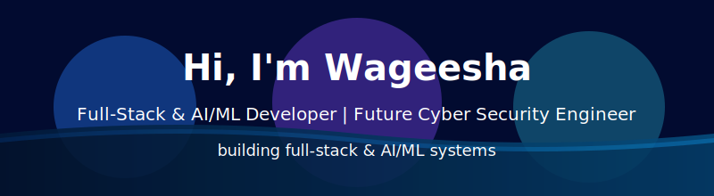

	

  

  

---

<!-- ===== About Me ===== -->
<table align="center" width="100%" style="border-collapse: collapse;">
  <tr>
    <td valign="top" width="55%" style="padding-right: 24px; line-height: 1.6; text-align: left;">
      <h2>👨‍🎓 About Me</h2>
      

        I’m <b>Wageesha</b>, a university student developer who builds
        <b>practical software systems</b> and <b>intelligent applications</b>, and is
        intentionally growing toward <b>secure systems, networking, and cyber security engineering</b>.
      

      <ul>
        <li>🔧 <b>Current focus:</b> Full‑Stack Development (frontend + backend) &amp; AI/ML engineering</li>
        <li>🛡️ <b>Future direction:</b> Cyber Security Engineer (secure systems, infrastructure, networking)</li>
        <li>🧠 <b>Strengths:</b> Systems thinking, problem‑solving, data‑driven mindset, learning by building</li>
        <li>🎯 <b>Short‑term goal:</b> Build a strong, industry‑ready foundation for internships &amp; junior roles</li>
        <li>🚀 <b>Long‑term vision:</b> Design and ship <b>secure, reliable, intelligent systems</b> end‑to‑end</li>
      </ul>
    </td>
    <td valign="middle" width="45%" style="text-align: center;">
      
    </td>
  </tr>
</table>

---

## 🧩 What I Do

| Area                         | What I Build / Practice                                                                 |
|-----------------------------|-----------------------------------------------------------------------------------------|
| 🌐 Full-Stack Engineering   | Web apps, dashboards, and platforms with clean architecture and real-world features     |
| 🤖 AI / ML                  | Small intelligent systems (CV, NLP, analytics) that solve concrete problems            |
| 🗄️ Data & Analytics         | Data flows, persistence, and insights for better decisions                             |
| 🛡️ Security Mindset (Growing)| Applying basic secure design principles, auth, and access control to my projects       |
| 🌐 Networking (Growing)     | Understanding how services communicate, and how that impacts reliability and security  |

---

## 🌟 Featured Projects

Selected projects that best represent my <b>full-stack</b>, <b>AI/ML</b>, <b>system-thinking</b>, and <b>security-aware</b> mindset.

### 1️⃣ BOSS – Operations / Management Platform
A full-stack system designed to manage core operations (e.g., entities, users, and workflows).

- 🧱 Emphasis on <b>modular architecture</b>, clear separation between frontend, backend, and data layer  
- 🔐 Introduced <b>basic auth, role-based access patterns</b>, and validation to keep data consistent  
- 📊 Built with a <b>system-thinking</b> approach: flows, states, and long-term maintainability

---

### 2️⃣ InsightLK – Analytics & Insights Dashboard
A data-focused application for turning raw information into visual insights.

- 📈 Dashboards and <b>data visualization</b> for monitoring key metrics  
- 🗄️ Careful <b>data modeling</b> and querying to keep analytics fast and relevant  
- 🌉 Bridges <b>backend APIs</b>, <b>databases</b>, and <b>frontend visual components</b>

---

### 3️⃣ Face-Recognition-System – Applied Computer Vision
An AI/ML project that experiments with <b>face recognition</b> and intelligent detection.

- 🤖 Uses <b>machine learning / computer vision</b> techniques for recognition tasks  
- 🔬 Focus on <b>experimenting, evaluating, and improving</b> model performance  
- 🛡️ Built with a <b>privacy-aware and security-conscious mindset</b> (e.g., controlled data usage)

---

### 4️⃣ Word-Wanted – Smart Learning / Productivity Tool
A tool-oriented project around words/content (e.g., learning, tracking, or assisting).

- 🧠 Shows an <b>AI/assistance mindset</b> and interaction design  
- 🔗 Integrates frontend, backend, and data storage in a clean way  
- ✨ Focus on <b>user experience</b>, responsiveness, and maintainable code

---

### 5️⃣ Mental-Breakdown_eGOV – Systems & Process Thinking
A project exploring more complex, process-heavy or e-government–style flows.

- 🏛️ Models <b>multi-step processes, roles, and states</b>  
- 🧩 Great for practicing <b>system design</b> and <b>access control concepts</b>  
- 🛡️ Used as a playground to think about <b>secure flows, permissions, and reliability</b>

> Other noteworthy work: <b>Examination-Department</b>, <b>Genies_STK</b>, <b>Penix-Chatbot</b>, <b>Doomforge</b> – showing range from admin systems to chatbots and creative builds.

---

## 🤝 Collaboration & Contributions

I like working in teams where we build, review, and improve together.

- 🧑‍💻 <b>How I collaborate</b>  
	- Writing clean, understandable code and helpful documentation  
	- Reviewing pull requests with a focus on clarity and correctness  
	- Discussing trade-offs (performance vs simplicity vs security)

- 🧲 <b>What I’m open to</b>  
	- Full-stack web projects (Dashboards, tools, internal apps)  
	- AI/ML experiments where we can ship something usable, not just notebooks  
	- Beginner-friendly <b>security-focused features</b> (auth, logging, basic hardening)

- 🌱 <b>What I try to bring</b>  
	- A <b>learning mindset</b>, curiosity, and consistency  
	- Attention to <b>data flows, edge cases, and future growth</b>  
	- Respect for <b>security and reliability</b>, even at a student level

---

## 📚 Currently Learning

I’m intentionally growing from “builder” to “secure systems engineer”.

- 💻 <b>Backend & Systems</b>  
	- Scalable APIs, database design, caching, background jobs  
	- Clean architecture, testing, and maintainability

- 🤖 <b>AI / ML</b>  
	- Better evaluation and monitoring for ML models  
	- Practical use-cases: classification, recommendation, basic NLP/CV

- 🛡️ <b>Security & Networking (Foundations)</b>  
	- Network fundamentals: TCP/IP, HTTP(S), DNS, routing basics  
	- Linux basics, permissions, and simple hardening  
	- Intro concepts: authentication, authorization, least privilege, basic threat modeling

---

## 🧰 Tech Stack

> A realistic snapshot of what I <b>actually use and learn with</b>.

### 🧾 Programming Languages

  
  
  
  
  
  
  
  

### 🌐 Frontend

  
  
  
  

### ⚙️ Backend / APIs

  
  
  
  

### 🗄️ Databases

  
  
  
  

### 🤖 AI / ML & Intelligent Systems

  
  

- Python AI/ML stack (NumPy, Pandas, scikit-learn)
- Computer vision with <b>OpenCV</b> (Face Recognition System)
- Multi-agent simulations with <b>Mesa</b>
- Ontology &amp; reasoning with <b>Owlready2</b> + SWRL rules

### 🔐 Security, Networking & Systems (Growing)

- Tools: <b>Wireshark</b>, <b>Nmap</b>, <b>Burp Suite</b>, <b>Metasploit</b>, <b>Netcat</b>
- Concepts: CIA triad, OWASP basics, recon &amp; scanning, traffic analysis
- Networking: TCP/IP, DNS, DHCP, HTTP/HTTPS, subnetting, routing

### 🧰 Dev Tools & Platforms

  
  
  
  
  
  

### 📦 DevOps & Other Tech (Learning / Exposure)

- Docker, VirtualBox / VMware, basic deployment
- Supabase, Next.js, Flutter/Dart, GraphQL, MQTT concepts

### 🎮 Specialized Systems I’ve Built

- Chatbot systems (rule-based + ML)
- Simulation systems (agents + ontology)
- Forecasting / analytics systems (InsightLK)
- Automation systems (e.g., attendance AI, social / content bots)

---

## 📈 GitHub Stats & Activity

  

  

  

---

## 🔗 Connect

I’m actively looking for <b>internships, student roles, and collaboration opportunities</b> related to:

- Full-Stack Development  
- AI/ML Engineering  
- Secure systems, networking, and early-stage cyber security work  

  <!-- Replace with your real links -->
  
  

---

  <i>I build practical software systems and intelligent applications, and I’m intentionally growing toward secure systems, networking, and cyber security engineering.</i>

